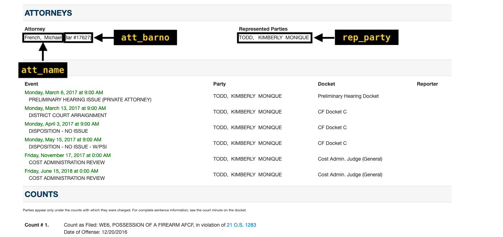
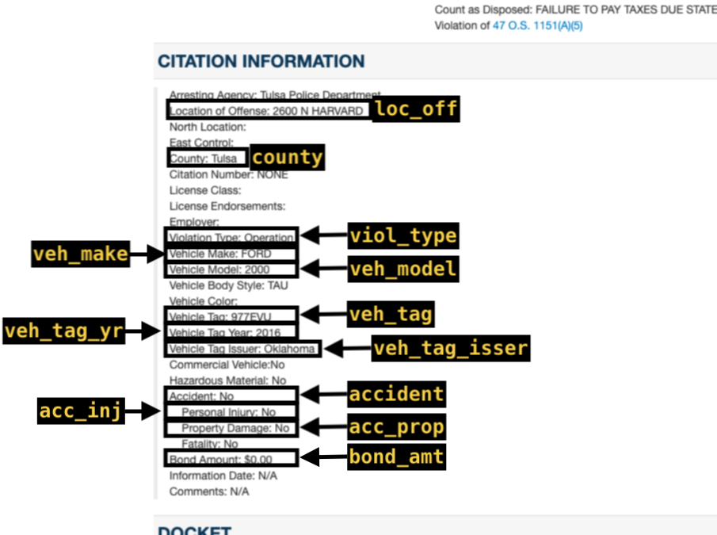
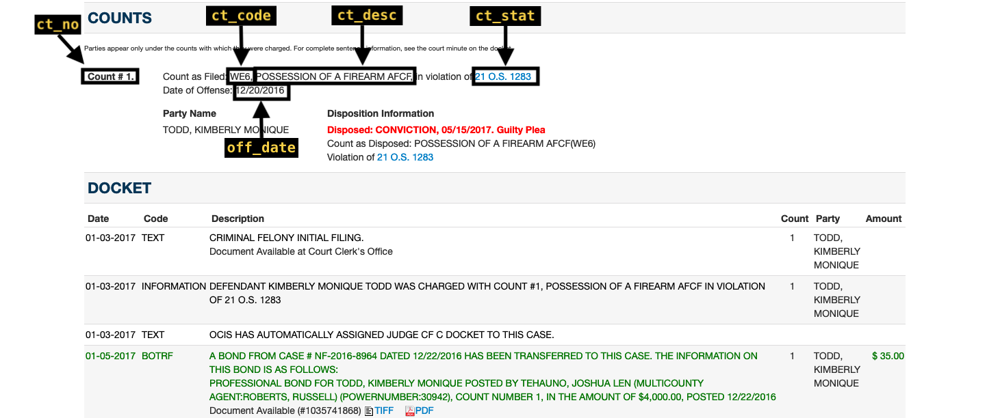
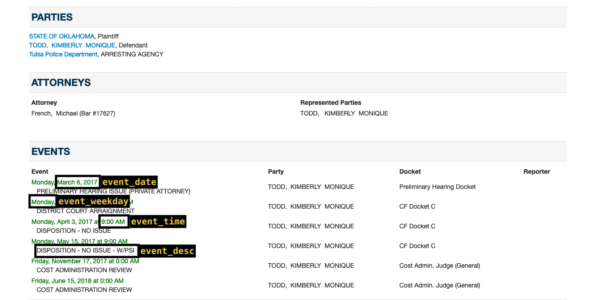
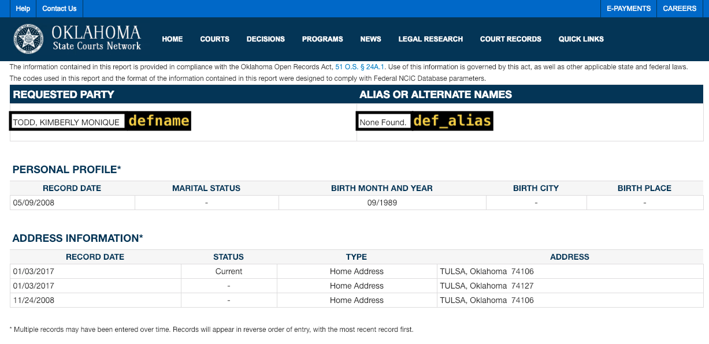
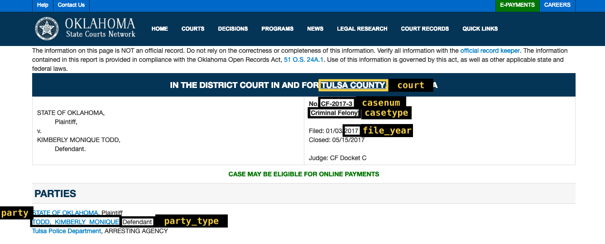
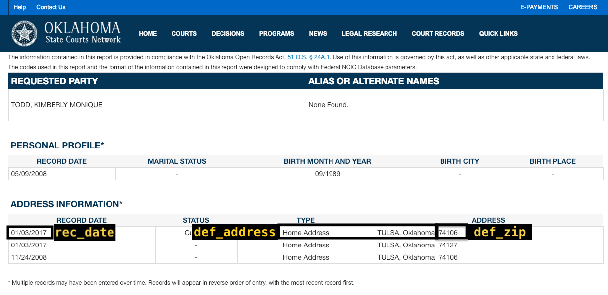
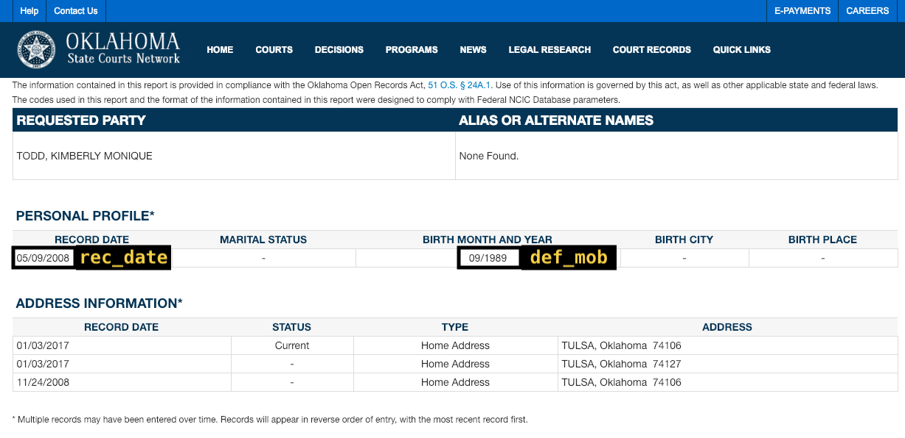

```{r, echo = FALSE, message= FALSE}
knitr::opts_chunk$set(
  collapse = TRUE,
  message = FALSE,
  echo = FALSE,
  comment = "#>",
  fig.width = 7,
  fig.height = 5
)
library(ojodb)
library(tibble)
library(htmlTable)
library(knitr)
dict <- read_csv("ojo-db data dictionary.csv")
```

The [Oklahoma State Courts Network (OSCN)](http://www.oscn.net/){target="_blank"} holds information on all types of criminal and civil cases filed in District Courts across Oklahoma. For 13 counties, including the 6 largest by population, the information available is extensive and structured consistently. Those 13 counties are:

1. Adair County (Stilwell)
2. Canadian County (El Reno)
3. Cleveland County (Norman)
4. Comanche County (Lawton)
5. Ellis County
6. Garfield County (Enid)
7. Logan County (Guthrie)
8. Oklahoma County (Oklahoma City)
9. Payne County (Stillwater)
10. Pushmataha County 
11. Roger Mills County
12. Rogers County (Claremore)
13. Tulsa County (Tulsa)

The relative ease of using data collected from OSCN allows us to perform more reliable and granular analysis. For this reason, we will begin a new project using this data rather than from ODCR. 

## Collection method

The `oscn_scrape()` function, included in the ojo R package, collects data from a given case and stores it in the OJO database. The function visits a case page ([example here](https://www.oscn.net/dockets/GetCaseInformation.aspx?db=canadian&number=TR-2016-6275&cmid=364366){target="_blank"}) and attempts to recognize types of data in the tables it finds in the page's HTML, puts the data into a dataframe in R, then uploads it. See function documentation for further details. 

### Case numbers
Each case filed in a District Court is given a case number following a straightforward pattern:

> [Two letter case type abbreviation]-[Year of filing]-[Sequential number of filing in District Court of filing]

For example, criminal misdemeanors are given the abbreviation "CM", so the first misdemeanor case filed in Adair County in 2020 is numbered CM-2020-1. The first misdemeanor case filed in Pushmataha County in 2020 is also numbered CM-2020-1.

In the OJO database, case numbers follow the same pattern, but we add filler zeroes to make all case numbers the same length. CM-2020-1 appears as CM-2020-00001 in the OJO database, for instance.

## `oscn_` tables

All tables containing OSCN data begin with the prefix `oscn_`. Below are the data dictionaries for each table, followed by screenshots showing where each variable comes from on a case record.

### `oscn_caseinfo`

```{r}
filter(dict, Table == "oscn_caseinfo") %>% kable()
```

{width=110%}

### `oscn_atts`

```{r}
filter(dict, Table == "oscn_atts") %>% kable()
```

{width=110%}

### `oscn_citations`

```{r}
filter(dict, Table == "oscn_citations") %>% kable()
```

{width=110%}
{width=110%}

### `oscn_civ_disps`

```{r}
filter(dict, Table == "oscn_civ_disps") %>% kable()
```

{width=110%}
{width=110%}

### `oscn_crim_disps`

```{r}
filter(dict, Table == "oscn_crim_disps") %>% kable()
```

{width=110%}

{width=110%}

### `oscn_events`

```{r}
filter(dict, Table == "oscn_events") %>% kable()
```

{width=110%}

### `oscn_mins_*`

To make querying more efficient, tables containing docket minutes (`oscn_mins_*`) are split by year and casetype. For example, all minutes for felony cases in 2016 are stored in `oscn_mins_2016CF`. The variables are the same in each of these tables.

```{r}
filter(dict, Table == "oscn_mins") %>% kable()
```

{width=110%}

### `oscn_party`

```{r}
filter(dict, Table == "oscn_party") %>% kable()
```

{width=110%}

### `oscn_party_names`

```{r}
filter(dict, Table == "oscn_party_names") %>% kable()
```

{width=110%}

### `oscn_party_address`

```{r}
filter(dict, Table == "oscn_party_address") %>% kable()
```



### `oscn_party_profile`

```{r}
filter(dict, Table == "oscn_party_profile") %>% kable()
```



### `oscn_pays_*`

```{r}
filter(dict, Table == "oscn_pays") %>% kable()
```

### `oscn_updates`

The `oscn_updates` table contains information on the dates and times at which the case was scraped.

```{r}
filter(dict, Table == "oscn_updates") %>% kable()
```


