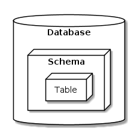

```{r, include = FALSE}
knitr::opts_chunk$set(
  collapse = TRUE,
  comment = "#>"
)
```

[](https://www.oscn.net/v4/)

# Intro: The OJO database

Many of our projects and requests involve pulling court data from our OJO database. There are a few other organizations and authorities who have collected this type of data in Oklahoma, but we're somewhat unique in the amount of data we have and the tools we've developed to pull and analyze it.

Our court data comes from two sources:

-   The [Oklahoma State Court Network website](https://www.oscn.net/v4/), the official record for the most populous and organized counties in the state, and

-   The [On Demand Court Records website](https://www1.odcr.com/), an alternate official record used by the less populous states.

We scrape the data posted on these websites each day, and store the contents in our database.

Having the data scraped and wrangled like this lets us answer questions that are harder to get a handle on otherwise. For example, legislators and stakeholders will often want to know things like "How many felonies were filed from 2018-2022?", or "How did eviction filings change during COVID, or as a result of X policy change?" It can be shockingly hard to answer even basic questions like that, even for government officials, and that's where our database comes in!

To get an idea of how to use the database to answer these kinds of questions, this vignette will walk through all the steps for a hypothetical research question.

## Research Question:

> How many misdemeanor cases involving drugs were filed in Oklahoma and Tulsa county in each month from 2016-2022?

## Before you proceed:

This vignette assumes that A) you've already installed `{ojodb}`, and B) your credentials and access to the database are properly configured -- most of the `{ojodb}` functions won't work if not. For more information on how to get everything set up, see `vignette("vignette-connecting-to-ojo")`. It can be a bit tricky to get working, so please ask for help if you have any issues!

# Step 1: Getting the lay of the land

Just for educational purposes, we'll start by taking a look around database and seeing exactly where the court data lives.

Our database is divided into a few "schemas" -- if our database is a big filing cabinet, we can imagine the schemas as separate drawers. You can see all of them using the `ojo_list_schemas()` function.

```{r, message=FALSE}
library(ojodb)
library(dplyr)

ojo_list_schemas()

```

Each schema, generally speaking, relates to one of our data types / topics / policy areas. Each one contains tables that store data related to that policy area. Among others, we have:

-   a schema for `ocdc` (Oklahoma County Detention Center, i.e. the jail in Oklahoma City),

-   another one for `odoc` (Oklahoma Department of Corrections, i.e. Oklahoma state prisons),

-   another for `eviction_addresses` (this one contains data related to a specific eviction-related project)

<center></center>

The court data that we're interested in right now is stored in the default schema, `public`. Let's open the "drawer" and see what kind of data is inside.

```{r}
ojo_list_tables(schema = "public")

```

If a schema is a drawer in our filing cabinet, then tables are the folders inside. The `public` schema contains several different tables, all of which relate back to our court data. Here are the most important ones to know:

-   The `case` table contains the basic information about each case. This includes variables like the case number, the date it was filed, the judge it was assigned to, etc. It also includes ID columns that allow you to join it with the other tables in this schema in order to see things like the defendant's name and DOB, attorneys involved, etc. Each row is one **case**.

-   The `count` table contains the individual charges filed in each case; most cases involve more than one. Each row is one **charge**.

-   The `minute` table contains the court minutes for each case. This is where we get data about court fines and fees, among many other things. There are a ton of minutes per case, so working with the minute data often means having to spend a lot of time waiting for data to download. Each row is one **court minute**.

We can see exactly which variables are included in each table using the `ojo_list_vars()` function. For example, let's take a closer look at the main `case` table:

```{r}
ojo_list_vars(schema = "public", table = "case")

```

We're interested in criminal cases right now, so we'll be pulling data from this table for our example research question.

<!-- ### One more note: -->

<!-- You'll notice that the `case` table includes most of the things you'd expect -- the filing district, year, case type, etc. However, you might be wondering why there are also columns for things like `minutes` and `issues` -- as we just saw, this information is actually stored in a separate table within the `public` schema. The answer is that these columns aren't storing the data in and of themselves; instead, they contain keys that we can use to join the `case` table with the others. -->

<!-- For example, let's take a look at what these columns look like in the first five rows of the `case` table, using the `ojo_tbl()` function: -->

<!-- ```{r} -->
<!-- first_five <- ojo_tbl(schema = "public", table = "case") |> -->
<!--  head() |> -->
<!--  collect() |> -->
<!--  select(id, minutes, counts) -->

<!-- first_five$id -->

<!-- first_five$counts -->

<!-- first_five$minutes -->

<!-- ``` -->

<!-- As you can see, these columns look a bit different, and don't store any data themselves. Instead, they contain *array* variables that we can use to join the `case` table to the `counts` and `minutes` tables as needed. Joining tables will be discussed more later, and our helper functions mean that we shouldn't have to think about this stuff outside of unusual circumstances. -->

<!-- To be clear, it's not crucial that you become an expert on database systems or anything like that. It is only mentioned here because it can be pretty confusing if you're new to databases. -->

# Step 2: Pulling our data -- `ojo_crim_cases()`

Now that we understand the basic layout of the database, we can start pulling the data we're interested in! Fortunately, we have helper functions that save us from having to think too much about schemas and tables in our daily work.

Keeping our research question in mind, we'll start by pulling all the **misdemeanor criminal cases** filed in **Oklahoma and Tulsa counties** from **2018-2022**. We'll use one of our helper functions, `ojo_crim_cases()`, to do so. It first queries the `case` table, then combines that table of **cases** with each case's **charges** from the `count` table.

```{r}
# This function combines the "case" and "count" tables in our database,
# and returns a cleaned dataframe where each row is one charge in a case.
charge_data <- ojo_crim_cases(districts = c("OKLAHOMA", "TULSA"),
                              case_types = "CM", # "CM" is short for "criminal misdemeanor"
                              file_years = 2018:2022) |>
  # you can add things like filter(), select(), etc. here
  collect()

```

The `collect()` function we're using is from the `{dplyr}` package. Our helper function `ojo_crim_cases()` uses the provided arguments to put together a query to our database, and the `collect()` function executes that query and returns the result as a lazy tibble into your R environment. If we wanted to, we could add in additional filtering, sorting, etc. by adding `{dplyr}` functions like `filter()`, `select()`, etc. before the `collect()` call. But for now, we want to see everything.

## Exploring the data we've pulled

Now we've got our data saved as the object `charge_data`, nice! Before we do anything else, let's start by taking a look at our dataframe in RStudio using the `View()` function (or just by clicking on it in your RStudio "Data" panel).

<center></center>

<!-- You'll probably notice those array columns like `id` and `counts` are still present; `ojo_crim_cases()` used them behind the scenes to join the charge data onto the case data, but we can more or less ignore those now since we're not using them in our analysis. -->

## Charges vs. Cases?

You'll probably notice that our dataframe includes data on the individual charges in each case, stored in `count_as_filed` and `disposition`. As discussed above, there's often going to be more than one charge involved in a given case, which means that we should note that our data is in terms of **charges**, not **cases**. Let's start by seeing how many of each we have here:

```{r, message=FALSE}
# How many total charges? ------------------------------------------------------
# The data are already in terms of charges (1 charge per row), so we can simply
# count the rows.
charge_data |>
  nrow()

# How many total cases? --------------------------------------------------------
# There's more than one charge per case sometimes, so we need to see how many
# unique cases there are total. Here are two possible approaches:

# Approach #1: Creating a new, unique district + case_number variable
charge_data |>
  # Case numbers are unique within districts; 
  # e.g. Tulsa's CM-2023-001 is a different case than Oklahoma's CM-2023-001.
  # We can create a new variable that will always be unique -- district + case_number
  mutate(case_number_with_district = paste(district, case_number)) |>
  distinct(case_number_with_district) |>
  nrow()

# This approach returns the number of unique case_number / district combinations, 
# but not much else.

# Approach 2: Making a new summary dataset with group_by() + summarize()
case_summary <- charge_data |>
  group_by(district, case_number) |>
  summarize(
    n_charges = n()
    # Note: if you want, you can add further summary variables here. 
    # For example, maybe you want to know how many charges in each case led to
    # a conviction. You could do something like this:
    # n_convictions = sum(disposition == "CONVICTION", na.rm = T)
)

nrow(case_summary)

# This tells us the number, and also leaves us with a helpful new case_summary
# dataset that we can use later on, if we want to know more.

```

It looks like `charge_data` includes `r nrow(charge_data) |> format(big.mark = ",")` rows. In other words, our data shows that there were `r nrow(charge_data) |> format(big.mark = ",")` total **charges** filed in Oklahoma and Tulsa county misdemeanor cases from 2018-2022.

On the other hand, it looks like there are `r charge_data |> dplyr::mutate(district_case_number = paste(district, case_number)) |> distinct(district_case_number) |> nrow() |> format(big.mark = ",")` unique combinations of `district` and `case_number` (and an equal number of rows in our new summary dataframe, `case_summary`). In other words, our data shows `r charge_data |> dplyr::mutate(district_case_number = paste(district, case_number)) |> distinct(district_case_number) |> nrow() |> format(big.mark = ",")` total misdemeanor **cases** filed in Oklahoma and Tulsa county from 2018-2022.

If we wanted to, we could divide those numbers (or use our handy `case_summary` dataframe) to see the average number of charges per case:

```{r}
# Total charges / total cases = Avg. number of charges per case
nrow(charge_data) / nrow(case_summary)

# Different approach, same thing
mean(case_summary$n_charges)

```

It seems there's an average of `r mean(case_summary$n_charges) |> round(2)` counts per misdemeanor case in this dataset. Neat!

It's very helpful to always be thinking about what the rows in your data represent. Keeping track of what exactly you're looking at (charges, cases, defendants, etc.) can be one of the most challenging parts of these analyses, especially when our client isn't exactly sure which they want to know about.

## Did we get everything we asked for?

Though we have data coverage and quality checks already as part of our scrapers and database, court data is always extremely messy, which can lead to unforeseen issues. Knowing this, it's usually a good idea to double check your data after you've pulled it in order to ensure `ojo_crim_cases()` returned all the data you requested.

We should at least check the data **geographically** and **temporally**; in other words, we should make sure there aren't any weird, unexpected differences between counties or between filing years / months. How exactly you do this due diligence is up to you, but one potential approach is to make a quick visualization or two. For example:

```{r, message=FALSE}
library(lubridate)
library(ggplot2)

# We're going to look at charges, not cases here
charge_data |>
mutate(
# Our end goal is to see monthly filings, so we'll use that same timeframe
month_filed = floor_date(date_filed, "months")
) |>
  count(district, month_filed) |> # Our two most important checks, geography and time
  ggplot(aes(x = month_filed,
             y = n)) +
  # I'm choosing geom_col() over geom_line() because I want to see any gaps clearly
  geom_col() + 
  facet_wrap(~district) +
  scale_y_continuous(limits = c(0, NA)) +
  labs(title = "Total charges filed per month in CM cases")

```

This graph looks pretty much as we'd expect it to -- there's not a huge difference between Oklahoma and Tulsa counties (which makes sense, given that they're similar in size), and there aren't any conspicuously missing months, suspiciously massive and sudden spikes / drops, etc. And while there is a lot of variation (particularly in Oklahoma county), there's nothing that looks suspicious enough for me to suspect a data issue. 

It would be great if there was an absolute source of truth that we could use to double check this stuff more reliably. An internal data quality monitoring dashboard that serves this purpose is on our list of goals, and hopefully that will serve as an easy reference point in the future. But for now, this part of the process is all about looking at the data from different angles and thinking critically about where you might run into potential issues, and how those issues might show up in your testing. Referencing past OKPI work is also another good option, and so is asking another analyst who is more familiar with the data in that area.

## Back to our research question

Now we've got a big dataset of all the charges we care about (`charge_data`) and another big dataset of all the cases we care about (`case_summary`), we've familiarized ourselves with what they look like and what they mean, and we've double checked that the data are all there. Let's revisit our research question now to see what cleaning and wrangling we need to do in order to finish answering it.

> How many **misdemeanor cases** involving **drugs** were filed in **Oklahoma and Tulsa county** in **each month** from **2016-2022**?

We've got the "misdemeanor cases filed in Oklahoma and Tulsa county from 2016-2022" part down, but we're still missing a few things. Namely,

-   we still need to filter our data to include only cases involving drugs, and

-   we still need to calculate the number of cases filed per month in this timespan.

We'll move on to those steps next.

# Step 3: Wrangling and cleaning the data

```{r}

```

# Step 4: Analyzing and graphing the data
